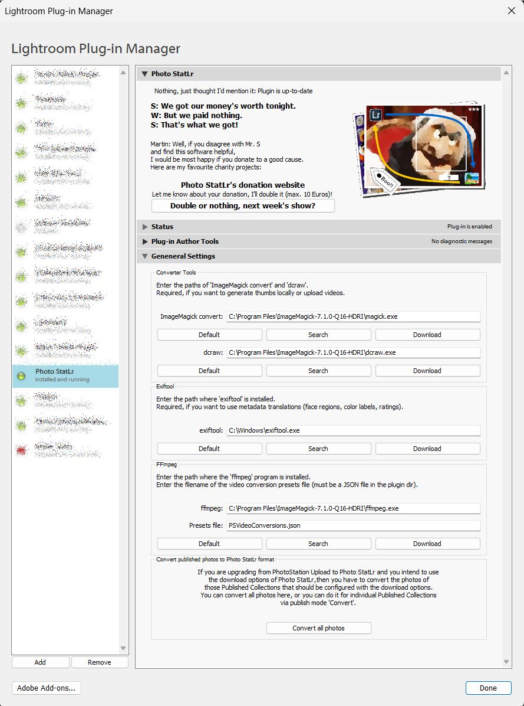
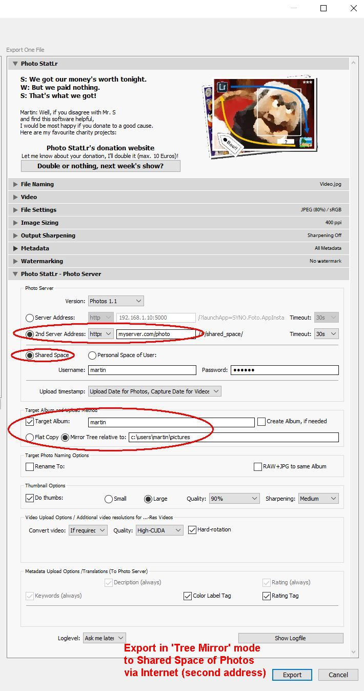
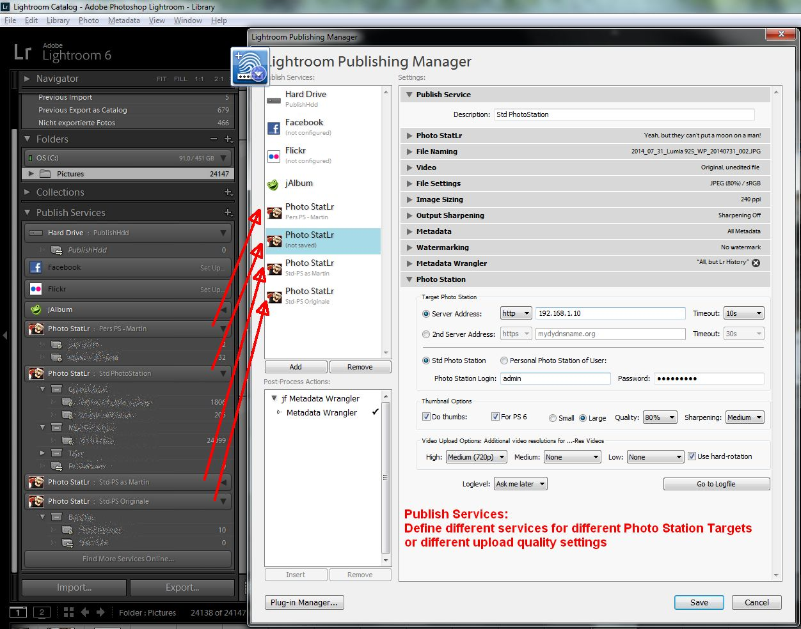
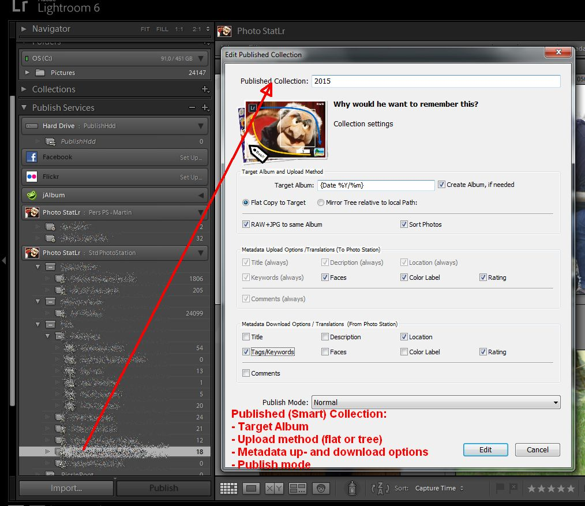
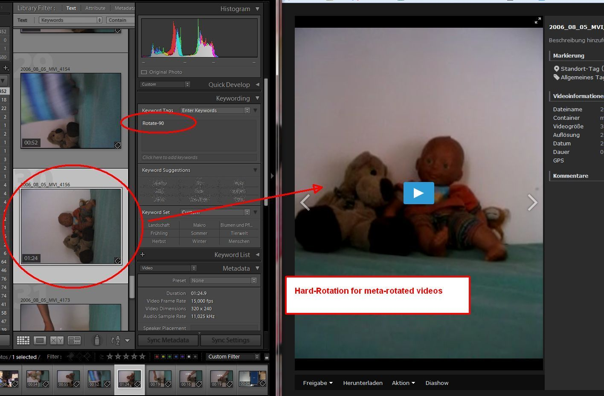
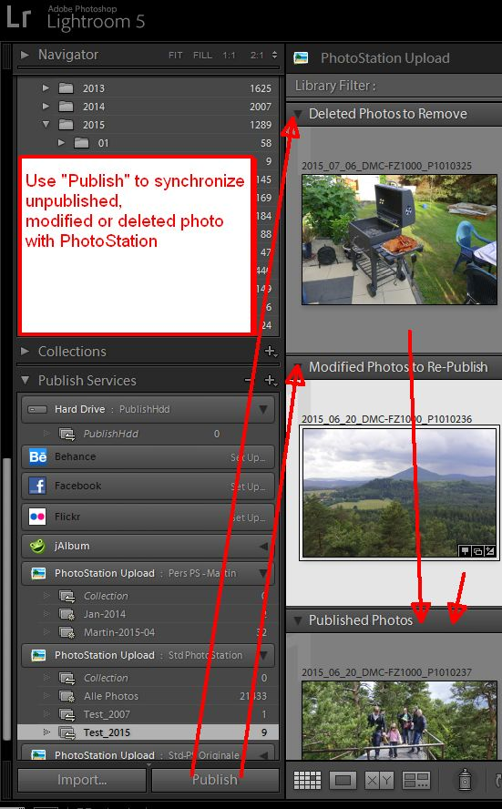
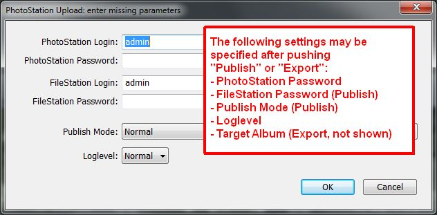
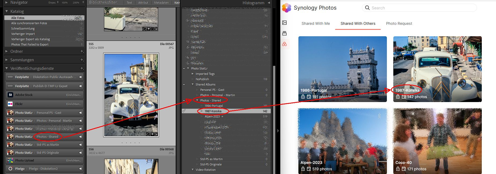
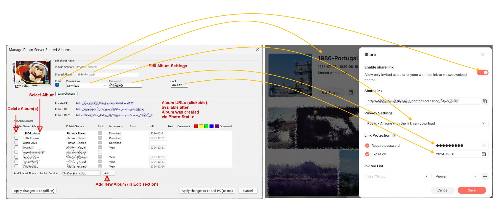
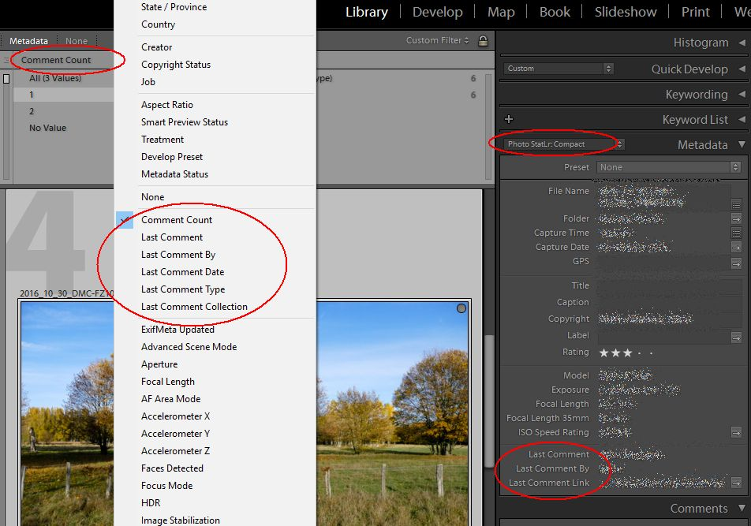

# Photo StatLr (Lightroom plugin)

Version 7.4.0 
__[Notes for migrating from Photo Station to Photos](Documentation/40-Migrating-from-PhotoStation-to-Photos.md)__ 

__[Important note for updating to V5.0 and above](releases/tag/v5.0.0)__ 
__[Important note for updating to V3.6.x and above]releases/tag/v3.6.0)__ 

[Changelog](CHANGELOG.md) 
[Releases](releases) 
[FAQs](Documentation) 

Forum threads: 
- [English Synology forum](https://community.synology.com/enu/forum/17/post/80082)
- [German Synology forum](https://www.synology-forum.de/showthread.html?62754-Lightroom-Export-Plugin-PhotoStation-Upload)

[Support Page](https://messmer-online.de/index.php/software/11-photo-statlr) 
[Donate to a good cause](https://messmer-online.de/index.php/software/donate-for-photo-statlr) 
[Get involved: Let Photo StatLr speak your language](Documentation/30-Contributions-How%20to%20contribute%20a%20translation%20for%20Photo%20StatLr.md) 
 
## Overview
Photo StatLr is a Lightroom Publish and Export Service Provider Plugin. It adds a new Publish Service and an Export target called "Photo StatLr" to the "Publish Services" panel / "Export" dialog. 
Both the Publish service as well as the Export service enable the export of photos and videos from Lightroom directly to a Synology Photo Station or Synology Photos. It will not only upload the selected photos/videos but also create 
and upload all required thumbnails and accompanying additional video files. 
Photo StatLr also supports the Lightroom "Get Comments" and "Get Rating" feature which will download comments and ratings from Photo Station to the Lightroom Comments panel (Library mode: bottom right panel).
Besides that Photo StatLr can do a real two-way synchronization of various metadata, including title, description/caption, tags/keywords, color label, rating, person tags/faces regions and GPS info. 

## Synology Photo Station and Synology Photos
This plugin supports Synology Photo Station and Synology Photos. Some of the plugin features are not supported on both systems. Throughout this document we use the term 'Photo Station' (for historical reasons), even if  the description applies to both systems. If there is a restriction to Photo Station, it will be marked with an asterisk (*).

# Requirements
* OS (Windows or Mac OS X):
	- Windows 7
	- Windows 8.0, 8.1
	- Windows 10
	- MacOS X:	7.5 - 16.0
	- MacOS 11:	0.1 - 6.2
	- MacOS 12:	0.0 - 1.0
* Lightroom: 
  	- Lr 4.0 - 6.14
	- Lr Classic 7.0 - 13.1
* Synology Photo Station:
	Photo Station 5, Photo Station 6, 6.5, 6.6, 6.7, 6.8
* Synology Photos:
	Photos 1.0 - 1.6
* For local thumbnail generation and for video upload, we need the following tools (not included, check the links under [Credits](#credits)). Alternatively, you may use the Synology Photo Station Uploader, which includes the required components:
	- ImageMagick/convert(.exe) 7.x
	- ffmpeg/ffmpeg(.exe) 4.x
* When uploading RAW (original) photos with locally generated thumbnails:
	- ImageMagick/dcraw.exe (Win) or dcraw/dcraw (MacOS)
* For metadata translations (e.g Lr/Picasa face regions, ratings and color labels):
	- exiftool: Version 11.x (tested) and later should be fine
	
# Installation
- install the required converters
- install exiftool (see credits below), if required 
  On Windows, __don't use "Run this program as administrator"__ setting (otherwise a command box will open everytime it is used and the plugin will not be able to get the output from exiftool)! 
  On Windows, use __'exiftool.exe'__ instead of __'exiftool(-k).exe'__ as program name (otherwise the plugin can't terminate the exiftool background process when done)! 
- download and unzip the Photo StatLr plugin archive from the [Photo StatLr GitHub project](https://github.com/flingo64/PhotoStation-Upload-Lr-Plugin/)
- copy/move the subdirectory "PhotoStation_upload.lrplugin" to the machine where Lightroom is installed
- In Lightroom:
	*File* --\> *Plugin Manager* --\> *Add*: Enter the path to the directory 
		"PhotoStation_upload.lrplugin" 

 - Select the 'Photo StatLr' plugin, open the section 'General Settings' and make sure the paths to the required converters and tools are correct.\
 Note for MacOS: please use the real path of the tools, not a symbolic link! To find out the realpath of the convert tool for example, you may use the following command:\
  `which convert | xargs realpath`
 

# Description

## Export vs. Publish Service - general remarks
Exporting in Lightroom is a simple one-time processe: you define the photos to export by selecting the photos or folders to export in library view and then choose "Export". 
Lightroom does not keep track of exports, thus if you want to re-export changed or added photos or remove deleted photos form the target (e.g. a Photo Station album) later, you will have to keep track yourself for those changes, addtions or deletions.

Publishing in Lightroom on the other hand is meant for synchonizing local photo collections with a remote target (e.g. a Photo Station album). To publish a photo collection you have to do two things:

- define the settings for the Publish Service
- define the Published Collection and the settings for that Published Collection

As soon as you've done this, Lightroom will keep track of which photo from the collection has to been published, needs to be re-published (when it was modified locally) or deleted. 
Besides that basic functions, some publish services can also re-import certain infos such as tags, comments or ratings back from the publish target.

## Export vs. Publish Service - Photo StatLr
The main functionality of Photo StatLr is basicly the same in Export and in Publish mode: uploading pictures/videos to a Synology Photo Station. 
On top of this the Publish mode also implements the basic publishing function, so that Lr can keep track of added, modified and deleted photos/videos. 
As of V5.0.0 Photo StatLr also supports downloading of certain metadata, so that changes to photos in Photo Station can be synched back to Lightroom. 

Due to the different handling of exporting and publishing in Lightroom the Export and the Publish dialog of Photo StatLr have some but not all of their settings in common. 

### Export Dialog
The Export dialog includes settings for:

1. Target Photo Server and Photo Area:
	- Server Version: Photo Station or Photos
	- Server Address: 
    	- Protocol: http or https
    	- Servername:
        	- Photo Station:
            	- <IP-Address_or_Hostname>[:\<port\>]
        	- Photos:
            	-  `<IP-Address_or_Hostname>:5000|5001` for access via launchApp path on standard DSM ports or
            	- `<IP-Address_or_Hostname>:<alternative_port>` for access via an alternative port as defined in DSM->Control Panel->Login Portal->Applications or
            	- `<IP-Address_or_Hostname>/<alternative_path>` for access via an alternative path as defined in DSM->Control Panel->Login Portal->Applications or
            	- `<IP-Address_or_Hostname>:<port>/<path>` for access via an alternative path on a non-standard port
            	- `<IP-Address_or_Hostname>:<port>/?launchApp=SYNO.Foto.AppInstance#` for acces via launchApp path on non-standard ports
    	- Timeout
	- Photo Area: 
    	- 'Shared Space'/'Std Photo Station' or 
    	- 'Personal Space'/'Personal Photo Station'
2. Target Album within the target Photo Server, Upload method, Renaming options
3. Quality parameters for thumbs and additional videos
4. Metadata Upload options

### Publish Service Dialog
The Publish Service dialog on the other hand includes settings for:

1. Target Photo Server and Photo Area
2. -- No -- Configured in Published Collections
3. Quality parameters for thumbs and additional videos
4. -- No -- Configured in Published Collections

### Collection Settings
The Album settings ( b) ) are not stored within the Publish settings but within the Published Collections settings. Therefore, you don't need to define a different Publish Service for each Published Collection you want to publish. In most cases you will only have one Publish Service definition and a bunch of Published Collections below it. An additional Publish Service definition is only required, if you want to upload to a different Photo Station or if you want to use different upload quality settings. 

## Export Funtionality
- Upload to the __Standard Photo Station__ or to a __Personal Photo Station__ (in Photos: __Shared Space__ or __Personal Space__) 
(make sure the Personal Photo Station feature is enabled for the given Personal Station owner)
- Definition of a __secondary server address__ 
You may want to publish to your Photo Station from at home or via the Internet. 
Therefore, the Export/Publish Service dialog lets you define two server addresses, with one of them being active. 
This eases the consistent definition of the Export/Publish settings for both access paths.
- Definition of the __file timestamp__ for the uploaded photo: photo capture date (good for sorting in File Explorer/Finder) or upload date (good for backup tools)

- __Two different upload methods__:
	- __Flat Upload__:  
	  This method uploads all selected pictures/videos to a named Album (use the folder name, not the Album name) on the Photo Station
	  The named Album may exist on the Photo Station or may be created during export
	  The root Album is defined by an empty string. In general, Albums are specified by "\<folder\>{/\<folder\>}" (no leading or trailing slashes required)
	- __Tree Mirror Upload__:  
	  This method preserves the directory path of each photo/video relative to a given local base path on the Photo Station below a named target Album.
	  All directories within the source path of the picture/video will be created recursively.
	  The directory tree is mirrored relative to a given local base path. Example: 
	  Local base path:	C:\users\john\pictures 
	  To Album:			Test 
	  Photo to export:	C:\users\john\pictures\2010\10\img1.jpg 
	  --\> upload to:	Test/2010/10/img1.jpg 
	  In other words:	\<local-base-path\>\\\<relative-path\>\\file -- upload to --\> \<Target Album\>/\<relative-path\>/file 

- __Dynamic Target Album__ definition by using  __metadata placeholders__: 
	Metadata placeholders are evaluated for each uploaded photo/video, so that the actual target album may be different for each individual photo/video.
	Metadata placeholders can be used to define a metadata-based Photo Station album layout, which is completely independent of the local directory layout.
	Metadata placeholders can also be used to define a Photo Station album layout, which is identical to an existing Collection Set hierarchy.
	Metadata placeholders look like: 
	  - {Date %Y}
	  - {Date %Y-%m-%d}
	  - {LrFM:cameraModel}
	  - {LrFM:isoRating}
	  - {LrRM:uuid}
	  - {Path:5}
	  - {LrCC:path ^Yearly Collections}
	  - {LrCC:name}
	  - {LrPC:name} 
  To learn more about the use of metadata placeholders and how they work, take a look at the [Metadata Placeholdes FAQ](Documentation/03-Publish%20and%20Export-How%20to%20use%20metadata%20placeholders%20in%20Target%20Album%20or%20Rename%20Photos%20To%20definitions.md) 

- __Rename photos__ in target album using __metadata placehoders__: 
     Rename photos to a unique naming schema in the target album 

- __Photo-plus-Thumbnail Upload__ (default) for faster Photo Station fill-up and to minimize load on the diskstation  

- __Photo-only Upload__ (optional) for a faster Upload: 
	This upload option makes sense, when you have a fast diskstation and you want the diskstation to do the thumbnail generation. 
	It also makes sense to upload w/ Photo-only option when you don't need the thumbnails on the diskstation (e.g. upload photos for backup purpose) and you upload to an un-indexed folder, so that no thumb conversion will be done on the diskstation. 
	Important note: It is not possible to keep already uploaded thumbs and just upload the photo itself. When you use the photo-only option, any belonging, already existing thumb on the diskstation will be removed! (Sorry, I wish I could do better)  

- Upload of __photo metadata__ including title*, description, keywords and GPS info* (from Lr or video header)
- __Metadata translations on upload:__ 
	- Translation of __Face regions__ generated by Lr or Picasa face detection to Photo Station Person tags*(useful for Photo Station below version 6.5) 
	- Translation of __Star Rating (* to *****)__  to Photo Station General tags (useful for Photo Station below version 6.5) 
	- Translation of __Color Label (yellow, red, etc.)__  to Photo Station General tags(+yellow, +red, etc.) 
	- Translation of __Location Tags (country, city, etc.)__ to a single Photo Station Location tag* (via additional Metadata Upload pass) 

- Upload of __original or processed videos__ and accompanying videos* with a lower resolution__ 
For more information on video processing with Photo StatLr read the [Video upload and conversion FAQ](Documentation/04-Publish%20and%20Export-Video%20upload%20and%20conversion%20with%20Photo%20StatLr.md) 

- Upload of __video metadata__ including title*, description, keywords, rating, label and GPS info* (both from Lr or video header) 

- __Different video rotation options:__ 
	- __Hard-rotation for soft-rotated videos__ for better player compatibility: 
	  Soft-rotated videos (portrait videos) are typically stored as as landscape video marked w/ a rotation flag in the mpeg header. Most player do not support this kind of rotation, so you will see the video unrotated / landscape. 	  Photo Station supports soft-rotated videos only by generating an additional hard-rotated flash-video.  This may be OK for small videos, but overloads the DiskStation CPU for a period of time.  Thus, it is more desirable to hard-rotate the videos on the PC before uploading. 
	  Hard-rotated videos with (then) potrait orientation work well in VLC, but not at all in MS Media Player. So, if you intend to use MS Media Player, you should stay with the soft-rotated video to see at least a mis-rotated video. 	In all other cases hard-rotation is probably more feasable for you.
	- __Soft-rotation or Hard-rotation for "meta-rotated" videos__: 
	  If you have older (e.g. .mov or .avi) __mis-rotated videos__ (like I have lots of from my children's first video experiments), these videos typically have __no rotation indication in the video header__. Thus, the described hard-rotation support won't work for those videos.  
	  To overcome this, the Uploader supports rotation indication via metadata maintained in Lr. 
	  To inidicate the desired rotation for a video, simply add one of the following __keywords__ to the video in __Lr__:
		- __Rotate-90__		--\> for videos that need 90 degree clockwise rotation
  		- __Rotate-180__	--\> for videos that need 180 degree rotation
		- __Rotate-270__	--\> for videos that need 90 degree counterclockwise rotation
	  Meta-rotated videos may be soft-rotated (by adding the rotation flag in the uploaded mp4-video) or hard-rotated. 
	  Please note, that if you use meta-rotation, the (soft- or hard-) rotated video will be uploaded as MP4 video, instead of the original video, which may have a different format/coding (e.g. .mov/mjpeg). 

- Configuration of __custom video conversion presets__ to define your prefered video quality, conversion methods and/or GPU accelaration to be used by the ffmpeg converter

- Processed __RAW+JPG to same Album__: 
	Most cameras support RAW+JPG output, where both files have the same basename, but different extensions (e.g. .rw2 and -jpg). If for any reason you wish to upload processed versions of both files, both files would map to the same upload filename (*.jpg) and
	thus override each others during upload. To circumvent this collision, this option will rename all non-jpg files to <orig-filename><orig-extension>.jpg.   

## Publish Functionality

- All Export functions are also supported in Publish mode

- Support for __Published Collections and Published Smart Collections__ 

- Support for __Published Collection Sets__
 
- __Different Publish modes__ (Published Collection dialog):
	- __Upload__: 
 	  Upload unpublished photos to target Album in target Photo Station. This is the expected normal publish method.
	- __MetadataUpload__: 
	  Upload only modified metadata (title, description, rating, color label, keywords/tags, GPS coords, face regions) to Photo Station. This publish mode is useful when photos have been tagged, but not edited after the last publishing, because uploading of metadata is must faster than uploading of a photo plus its thumbnails. Note, that the plugin cannot identify whether the photo was edited (has modified development settings) or just tagged. So, if you use this publish mode for an edited photo, only the modified tags will be uploaded to Photo Station, but not the changed photo itself. 
	- __CheckExisting__: 
  	  Unpublished or To re-publish photos will not be uploaded, but will be checked whether they already exist in the target Album and if so, set them to 'Published'. 
  	  This operation mode is useful when initializing a new Published Collection: if you have exported the latest version of thoses photos before to the defined target but not through the newly defined Published Collection (e.g. via Export).
	  CheckExisting is approx. 50 times faster (__~ 15 photos/sec__) than a normal Publish, since no thumbnail creation and upload is required.
  	  Note, that CheckExisting can not determine, whether the photo in the target Album is the latest version.
	- __CheckMoved__: 
	  Check if any photo within a Published Collection has moved locally and if so, mark it 'To re-publish'
	  If your Published Collection is to be tree-mirrored to the target Album, it is important to notice when a photo was moved locally between directories, since these movements have to be propagated to the target Album (i.e., the photo has to be deleted at the target Album at its old location and re-published at the new location).
	  Unfortunately, Lightroom will not mark moved photos for 'to Re-publish'. Therefore, this mode is a workaround for this missing Lr feature. To use it, you have to set at least one photo 'To re-publish', otherwise you won't be able to push the "Publish" button.
	  CheckMoved is very fast (__\>100 photos/sec__) since it only checks locally whether the local path of a photo has changed in comparison to its published location. There is no communication to the Photo Station involved. 
	- __MovePhotos__: 
  	  Unpublished and 'To re-publish' photos will not be uploaded, but will be moved within the Photo Station in case their current upload path is different from the upload path that would apply if they would be uploaded now. This mode is good for various scenarios: 
  	  a) After uploading photos to a specific target album (flat copy) you decide to change the target album for those photos 
  	  b) After uploading photos using the tree copy mode you decide to move those photos locally to a different directory (you may use CheckMoved to find those photos) 
  	  c) After uploading photos to a dynamic target album (using metadata placeholders) any of the referenced metadata has changed.   
  	  Photos not yet published will remain Unpublished. The MovePhotos mode avoids re-generating and uploading of thumbs and thus is faster than a normal upload.
	- __Convert__: 
	  This mode is used to convert photos in a an old-style (e.g. \<5.0.0) Published Collection to Published Collection which supports comments and ratings (v.5.0.0 and above) 
	- __Ask me later__: 
	  This is not a publish mode itself but let's you postpone the publish mode decision to the point in time where the actual publish action is started (e.g. when you click the "Publish" button) 

- Impose __sort order of photos in Lr Published Collections__ * in Photo Station: 
	Sort order is only supported on Published Collections w/ Custom Sort Order when uploaded as Flat Copy 

- __Deletion of published photos__, when deleted locally (from Collection or Library)

- __Deletion of complete Published Collections__

- __Deletion of empty Photo Station Albums__ after deletion of published photos or complete Published Collections

- Settings of a __Default Collection__ will serve as default for new Published Collection within the same Publish Service  
  Using the Default Collection you can define your own collection setting defaults instead of using the plugin's defaults.  
  __Note:__ When you create a new Photo StarLr Publish Service Lr will create a first Published Collection called "Default Collection". The Default collection is typically shown in italics.
  You may rename the Default Collection and use it for normal publishing. 
  Default Collections in Publish Services created with Photo StatLr __before v5.8.0__ however will __not__ be shown in __italics__ and may have been __moved__ to a Collection Set or even have been __removed__ completely. 
  To identify the Default Collection, just edit an existing Published Collection: the name of the Default Collection will be shown in the header section of the dialog.
  If the Default Collection has been removed before (this was possible in Photo StatLr befor v5.8.0) there is no way to create a new Default Collection for that Publish Service.     

- Manage __Photo Server Shared Albums__ * via Shared Album keyword hierarchies in Lr: 
  Define Shared Album keywords under "Photo StatLr" | "Shared Albums" | "\<Publish Service Name\>" and assign them to photos you want to link to Photo Server Shared Albums.
  As soon as you publish the respective photos (Publish mode "CheckExisting" is fine enough) via the given \<Publish Service\>, they will be linked to or removed from the given Shared Albums. 
  
  You may also use the 'Manage Shared Albums' dialog found under  __Library -> Plug-in Extras -> Manage Shared Albums__  to define further Shared Album settings for public access such as access permissions, password or expiration date or to add and delete Shared Albums. 

  For more info please read the [Shared Albums FAQ](Documentation/06-Publish-Managing%20Photos%20Shared%20Albums%20in%20Lightroom%20via%20Photo%20StatLr.md).

## Download / Sync Functionality
- Support for download of __Comments__v
	- Download of private and public comments* from Photo Station
	- Lr plugin metadata for comments: __search and filter__ photos with comments 
	- __Metadata Tagsets__ to view comments in the Metadata panel 
	For more info please read the [Comments FAQ](Documentation/08-Publish-Some%20comments%20on%20comments.md).

  

- __Download and two-way sync of various metadata__ for photos and videos:
	- title*, description/caption
	- rating (for Photo Station 6.5 and above)
	- general tags (Keywords)
	- GPS info* (added via Location Tag)
	- sync PS keywords with Lr keyword hierarchies and synonyms
	- support for adding hierachical keywords (format: {<keyword>|}keyword) from PS to Lr 
 	- Translation of __Star Rating tags (* to *****)__  to Lr rating (useful for Photo Station below version 6.5) 
	- Translation of __Color Label tags (+yellow, +red, etc.)__  to Lr color label  
	- Translation of __Person tags__  * to Lr face regions (requires reloading of photo metadata from file) 
	
- __Different Download modes__:
	- __Yes__: 
	  Download of the configured metadata items will start immediately after a publish action or when you click "Refresh Comments". 
	- __No__: 
	  Download of the configured options will be suppressed. This mode is good to temporarily disable the download of the configued metadata items while keeping the download option configuration itself. 
	- __Ask me later__: 
	  This is not a download mode itself but let's you postpone the download mode decision to the point in time where the actual download action is started (e.g. after a publish action or when you click the "Refresh Comments" button).
	  This mode is useful if you do not want to download metadata after every publish action, but only occasionally. 

- For more detail, please read the [Metadata Two-way Sync FAQ](Documentation/07-Publish-Some%20words%20on%20the%20two%20way%20sync%20of%20metadata.md)

## Additional Funtionality
- __Checks for updates__ in background when Exporting, Publishing or opening the Plugin section in the Plugin Manager no more than once per day.
  If a new version is available, you'll get an info message after the Export/Publish and also a note in the Plugin Manager section.
  The update check will send the following information to the update server:
	- Photo StatLr plugin version
	- Operating system version
	- Lightroom version
	- Lightroom language setting
	- a random unique identifier chosen by the update service 

This helps me keep track of the different environments/combinations the plugin is running in.

## Important note
Passwords entered in the export settings are stored unencrypted, so they might be accessible by other plugins or other people that have access to your system. So, if you mind storing your password in the export settings, you may leave the password field in the export settings empty so that you will be prompted to enter username/password when the export starts.

## Open issues
### Generic issues
- due to missing Lr SDK support for face region handling, face regions downloaded from Photo Station will be written to the original file (or xmp side-car file in case of RAW photos) and wil have to be manually re-synched w/ Lr. 
Face regions can't be downloaded for cropped photos, since Lr won't accept the face region metadata if the "AppliedDimension" are not equal to the original photo dimension.
- Face regions added via XMP re-import are not properly synched w/ Lr's database: if you change or delete one of those in Lr, it won't be reflected in the XMP of the photo file. 
### Synology Photo Station
- if video aspect ratio is different from video dimension 
  (i.e. sample aspect ratio [sar] different from display aspect ratio [dar]) 
  the galery thumb of the video will be shown with a wrong aspect ratio (= sar)
### Synology Photos
tbd.

# Copyright
Copyright(c) 2015-2024, Martin Messmer

Photo StatLr is free software: you can redistribute it and/or modify
it under the terms of the GNU General Public License as published by
the Free Software Foundation, either version 3 of the License, or
(at your option) any later version.

Photo StatLr is distributed in the hope that it will be useful,
but WITHOUT ANY WARRANTY; without even the implied warranty of
MERCHANTABILITY or FITNESS FOR A PARTICULAR PURPOSE.  See the
GNU General Public License for more details.

You should have received a copy of the GNU General Public License
along with Photo StatLr.  If not, see <http://www.gnu.org/licenses/>.

# Credits
Photo StatLr uses the following phantastic free software to do its job:
- [convert](http://www.imagemagick.org/) by ImageMagick
- [dcraw](http://www.dechifro.org/dcraw/) by David J. Coffin
- [ffmpeg](https://www.ffmpeg.org/) by ffmpeg.org
- [JSON.lua](http://regex.info/blog/lua/json) by Jeffrey Friedl
- [exiftool](http://www.sno.phy.queensu.ca/~phil/exiftool/) by Phil Harvey
- Optional: [Synology Photo Station Uploader](https://www.synology.com/de-de/support/download/DS218+?version=6.2#utilities) by Synology

Thanks to all you folks providing these real valuable software gems. This plugin would be nothing without it!

Thanks for contributing code to the project:
	- Filip Kis (metadata placeholder {LrPC})

Thanks for the amazing, astounding, boooor-ing quotes from:
http://www.imdb.com/character/ch0000704/quotes ;-)
